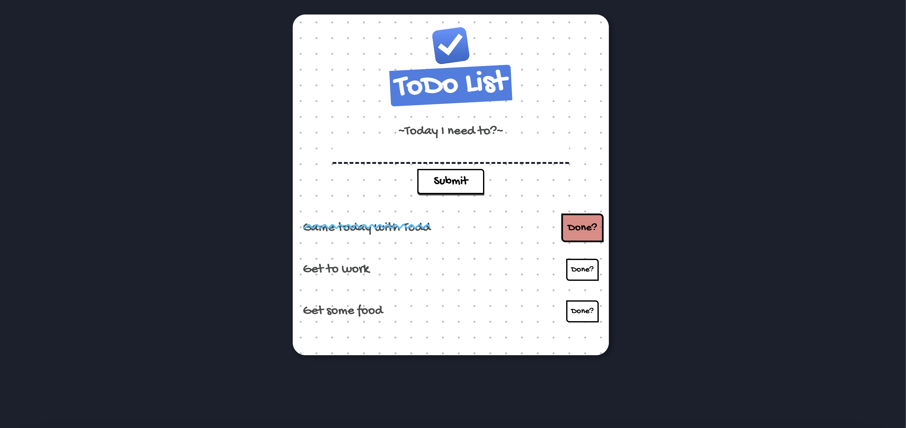

# Lara-Todo

### Description

Learning laravel by building a very basic Todo app with what I've learnt so far.

### Installation

You can clone this project and run it in as a laravel project. You will need to create your own mysql DB(or any other DB you can use on Laravel, SQLlite wink wink)https://github.com/ogooluwanick/Lara-Todo).

### Screenshots

